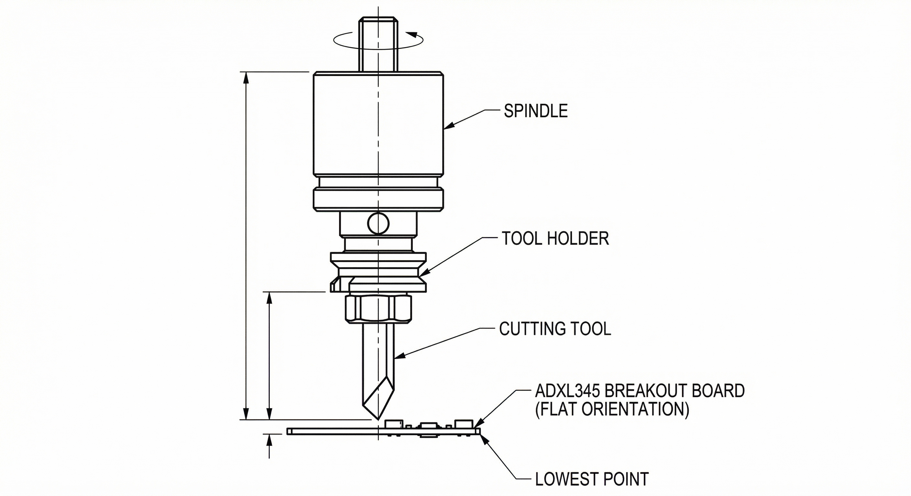

# Tap Testing for Milo

Tap testing application for measuring tool vibrations using an accelerometer mounted at the tool tip. **We default to impulse excitation**: a hammer tap excites the structure and the ADXL345 records the response for analysis (e.g. frequency content, decay).

## Scope

- **Hardware**: ADXL345 accelerometer + Raspberry Pi
- **Excitation**: **Impulse** by default (hammer tap); excites many frequencies at once
- **Use case**: Mount accelerometer on tool, tap with hammer, capture and store vibration data
- **Stack**: Python 3, I2C (or SPI) to the ADXL345

## Hardware

- **Raspberry Pi** (3B+, 4, or 5)
- **ADXL345** (±2g / ±4g / ±8g, I2C or SPI)


- Wiring (I2C example):
  - ADXL345 `VCC` → 3.3 V
  - ADXL345 `GND` → GND
  - ADXL345 `SDA` → Pi GPIO 2 (SDA)
  - ADXL345 `SCL` → Pi GPIO 3 (SCL)
  - Optional: `CS` high for I2C (or tie to 3.3 V); see ADXL345 datasheet for I2C vs SPI

Enable I2C on the Pi: `sudo raspi-config` → Interface Options → I2C → Enable.

**Status LED (optional)**  
The ADXL345 breakout has no user-controllable LED. For the **run_cycle** script you can connect an LED (with a suitable series resistor, e.g. 330 Ω) to a Raspberry Pi GPIO pin. Default: **GPIO 17 (BCM)**. LED **ON** = recording (tap now); **OFF** = waiting between taps. On the Pi, install `RPi.GPIO` if needed: `pip install RPi.GPIO`. Use `--no-led` to run without a LED.

## Installation

### System (Raspberry Pi)

```bash
sudo apt update
sudo apt install -y python3-pip python3-venv python3-dev
# Enable I2C: sudo raspi-config → Interface Options → I2C
```

### Project

```bash
cd tap-testing
python3 -m venv venv
source venv/bin/activate   # Windows: venv\Scripts\activate
pip install -r requirements.txt
```

### Testing (optional)

Tests use **pytest** and synthetic data only (no Pi or accelerometer required):

```bash
cd tap-testing
pip install -r requirements-dev.txt   # adds pytest
pytest tests/ -v
```

See `tests/` for what is covered: CSV load/save, FFT dominant frequency, RPM avoid/suggested ranges, combine logic, config defaults, and chart figure generation.

## Usage

To see all available commands from the start:

```bash
python -m tap_testing --help
```

**Recording and analysis**

- **Record a tap**: `python -m tap_testing.record_tap` — records for a fixed duration, saves CSV to `data/tap_001.csv` by default. Use `-o`, `-d`, `-r` for output path, duration, and sample rate.
- **Run 3-tap cycle (recommended)**: `python -m tap_testing.run_cycle` — runs 3 tap tests 5 s apart (configurable with `-s`), combines the data, analyzes, and shows/saves the RPM chart. Optional **status LED** on a Pi GPIO: **ON = tap now**, **OFF = wait**. Output goes to `data/cycle/<timestamp>/`.
- **Tap cycle with GUI (Pi)**: `python -m tap_testing.cycle_gui` or `python -m tap_testing.run_cycle --gui` — opens a window showing **live status** (e.g. "Tap 1/3 — TAP the tool now", "Waiting 15 s…") and, when done, the **RPM band chart** (red = avoid, green = optimal) in the same window. Same LED and output dir as run_cycle. **Desktop shortcut**: see [docs/DESKTOP_SHORTCUT.md](docs/DESKTOP_SHORTCUT.md) for Windows and Linux.
- **Homing calibration GUI**: `python -m tap_testing.homing_gui` — records a single stream of ADXL data while the machine runs its homing sequence (Z up, then X/Y home). Use to capture motion and direction for spindle-mounted accelerometer calibration. Shows live X/Y plot; does not use Moonraker or Klippy. Optional **`--modbus`** polls Modbus (**RTU** default for VFD RS-485) during the same recording and saves **`modbus.csv`** plus live register plots; use **`--modbus-profile h100`** or **`TAP_MODBUS_PROFILE=h100`** for the H100 VFD map — [docs/MODBUS_H100_VFD.md](docs/MODBUS_H100_VFD.md), [docs/MODBUS_RASPBERRY_PI.md](docs/MODBUS_RASPBERRY_PI.md). See [docs/ADXL345_WIRING.md](docs/ADXL345_WIRING.md) for wiring.
- **Analyze and get speed/feed guidance**: `python -m tap_testing.analyze data/tap_001.csv --flutes 4 --max-rpm 24000 --tool-diameter 6` — prints natural frequency, RPMs to avoid, and a suggested stable RPM range. To analyze a past cycle run use the combined CSV: `python -m tap_testing.analyze data/cycle/<timestamp>/combined.csv --flutes 4 --max-rpm 24000 --plot`. Use `--plot` to show a chart (red = avoid, green = optimal) or `--plot-out file.png` to save it. Use `--plot-spectrum` or `--plot-spectrum-out file.png` to generate the FFT magnitude spectrum (impact-test analysis: verify dominant peak). Use `--chip-load` for example feed. For the **recommended order** of analysis and all visualizations (time signal → spectrum → FRF when force → RPM/optimal loads/resonance map → milling dynamics), use `--workflow` or `--plot-all` and see **[docs/ANALYSIS_WORKFLOW.md](docs/ANALYSIS_WORKFLOW.md)**.
- **Chatter identification (cutting recording)**: Record accelerometer data **during a cut** (same CSV format: `t_s`, `ax_g`, `ay_g`, `az_g`). Then run `python -m tap_testing.analyze data/cut_001.csv --chatter --natural-freq 920 --flutes 4` (use your tap-test natural frequency for `--natural-freq`). The tool reports whether a significant peak falls in the natural-frequency band (chatter likely), the dominant and top peaks, and suggested spindle speeds from the stability-lobe formula. Use `--chatter-plot-out file.png` to save the spectrum with fn band and peaks marked; use `--rpm` to pass the spindle RPM during the cut for tooth-passing context. See **[docs/CHATTER_IDENTIFICATION.md](docs/CHATTER_IDENTIFICATION.md)** for the full workflow.
- **Spindle force / torque / power charts**: From tool geometry, RPM, depth of cut, and chip load you can plot **force and torque** (see *Total force on the spindle* below). **Single point**: `python scripts/plot_spindle_force.py -d 6 -n 4 --depth 5 --rpm 18000 --chip-load 0.05 -o spindle_force.png`. **Sweep RPM**: `python scripts/plot_spindle_force.py -d 6 -n 4 --depth 5 --chip-load 0.05 --sweep rpm --rpm-min 10000 --rpm-max 24000 --steps 8 -o spindle_vs_rpm.png`. **Sweep depth**: `python scripts/plot_spindle_force.py -d 6 -n 4 --rpm 18000 --chip-load 0.05 --sweep depth --depth-max 10 -o spindle_vs_depth.png`. Use `--spindle-limit 1500` to draw the spindle power limit on the power curve.

**Diagnostics and inspection**

- **Check accelerometer (live stream)**: `python -m tap_testing.check_sensor` — prints live X,Y,Z and magnitude until Ctrl+C.
- **SPI / device probe**: `python -m tap_testing.verify_spi_accel --probe` — finds which spidev has the ADXL345 (DEVID 0xE5). `python -m tap_testing.verify_spi_accel --samples 20 --rate 100` streams a few samples and checks gravity (mean |a| ≈ 1 g at rest).
- **SPI mode**: `python -m tap_testing.check_spi_mode --all` — list all spidev devices and their mode (ADXL345 needs Mode 3).
- **Inspect recorded data**: `python -m tap_testing.inspect_tap_data <path>` — `<path>` can be a single CSV or a cycle directory (e.g. `data/cycle/<timestamp>`). Prints per-file stats and **Signal: OK (usable)** or **NO SIGNAL**. For a full verification sequence, see [docs/ADXL345_WIRING.md](docs/ADXL345_WIRING.md).

---

## Force excitation

Common ways to excite a structure for FRF or natural-frequency measurement:

- **Sine-sweep** — Fixed-frequency sine; response is measured one frequency at a time with averaging.
- **Random** — Broadband (white) or band-limited (pink) noise; averaging over a fixed time.
- **Impulse (impact)** — A short impact (e.g. hammer tap) excites many frequencies at once; multiple taps are often averaged in the frequency domain to improve coherence.

*In a nutshell:* hitting the structure with a hammer excites many frequencies at almost the same level at the same time. **This code defaults to impulse (impact) excitation**: you tap the tool with a hammer, and the accelerometer records the response. **We do not measure force in the basic setup**, so we get the response spectrum (FFT) and identify the dominant natural frequency; with a force sensor at the tap point we could compute the full FRF (receptance/inertance). That means: **response-only** tap test → natural frequency, avoid RPM, suggested RPM band, and best stability lobe speeds; **full FRF** (impact with force in x and y) would be needed to plot the stability lobe diagram (limiting chip width blim vs spindle speed Ω). Multiple taps (e.g. `run_cycle`) improve the estimate. For hardware, an impact hammer with a force transducer in the tip is the usual choice for tool-holder testing; plastic tips avoid damaging the cutting edge and give sufficient bandwidth.

### Vibration measurement (transducers)

- **Noncontact** transducers (e.g. capacitance, laser) do not influence dynamics; **contacting** types (e.g. accelerometers) are more convenient. **We use the ADXL345** for measurement: a low-mass accelerometer so that a few grams or less does not appreciably alter the response; it can be attached with wax and removed without damaging the tool.
- The accelerometer signal is proportional to **acceleration**, so we obtain **inertance** (A/F). To get **receptance** (X/F): X/F = (A/F) / ω² (double integration in the frequency domain).
- Amplifier and DAQ can introduce a **time delay** → phase error that increases linearly with frequency. The measured phase can be corrected as φ_c(f) = φ_m − S·f, where S (deg/Hz) comes from the delay or from calibration; the real and imaginary parts of the FRF are then updated from the magnitude and corrected phase. See `tap_testing.transducers` for conversion and phase-correction helpers.

### Impact test data and graphs

With the **current hardware** (accelerometer only) we do not measure force, so we cannot plot the FRF (receptance/inertance) or the stability lobe diagram (blim vs Ω). We provide: natural frequency, avoid RPM, suggested RPM band, and best stability lobe speeds. The graphs used for impact-test analysis are:

1. **Time-domain response** — Tap cycles (magnitude vs time) and average; optional decay envelope.
2. **Frequency spectrum (FFT magnitude)** — Frequency vs magnitude with natural frequency marked; per-tap and average in the cycle figure; `--plot-spectrum` / `--plot-spectrum-out` in the analyzer.
3. **Optional decay envelope** — Exponential envelope on the time trace and estimated damping ratio (when available).
4. **FRF magnitude/phase** — When force is measured (CSV with columns `Fx_N`, `Fy_N` or `F_N`), run `python -m tap_testing.analyze data/tap_with_force.csv --plot-frf` or `--plot-frf-out file.png` to compute and plot inertance (or receptance). See `load_tap_csv_with_force`, `compute_frf_from_impact`, `plot_frf_figure` in `tap_testing.analyze`.
5. **Stability lobe (blim vs Ω)** — When x,y FRFs and cutting coefficients are available (impact testing with force measurement), use `compute_stability_lobe_boundary` and `plot_stability_lobe_figure` in `tap_testing.analyze` to plot the stability boundary.

**Ideal milling parameters:** (1) **RPM** from tap test (avoid + suggested + best lobe speeds). (2) **Depth** from stability lobe when FRF and cutting coefficients are available. (3) **Feed** from chip load and RPM. Full stability lobe (blim vs Ω) requires x,y FRFs from impact testing with force measurement and cutting coefficients.

---

## From tap test to spindle speed and feed

### Why it matters

The tap test excites the **tool–holder–spindle** structure. The dominant frequency in the response is (approximately) the **first natural frequency** of that assembly. During milling, if the **tooth passing frequency**—or one of its harmonics—matches this natural frequency, you get **chatter** (resonance). So we use the tap test to find that frequency, then choose spindle speeds that avoid it.

### How we get spindle speed from the tap test

1. **Record** — Mount the accelerometer, tap the tool, run `record_tap` to get a CSV (time, ax, ay, az).
2. **Analyze** — Run `analyze` on the CSV. It:
   - Computes an FFT of the vibration (magnitude or a single axis).
   - Picks the **dominant natural frequency** (peak in the FFT).
   - Uses the relation **tooth passing frequency = (RPM/60) × N_teeth**.
   - **RPMs to avoid**: resonance when `(RPM/60) × N_teeth × k = natural_freq_hz` ⇒  
     `RPM = 60 × natural_freq_hz / (N_teeth × k)` for k = 1, 2, 3, …
   - Suggests a **stable RPM range**: a “pocket” between those critical RPMs where you are less likely to chatter.
3. **Choose RPM** — Pick a spindle speed inside the suggested range (or at least away from the “avoid” list).
4. **Feed** — Feed is not set by the tap test; it’s set by **chip load in mm per tooth**, number of teeth, and RPM:  
   **Feed (mm/min) = chip_load_mm × N_teeth × RPM**.  
   Use material/tool guidelines for chip load; the tap test only tells you which RPM range is safe. The analyzer can print an example feed for a given chip load with `--chip-load`. **If your reference gives chip load in inches per tooth** (e.g. 0.002 in/tooth), convert to mm/tooth first: multiply by 25.4 (e.g. 0.002 in/tooth → 0.0508 mm/tooth).

### Parameters

When analyzing, you can define:

- **`--max-rpm`** — Maximum spindle RPM (default **24000**, standard LDO Milo spindle). The avoid/suggested ranges and the chart use min RPM 4000 up to this max. Set a different max when testing another spindle.
- **`--tool-diameter`** — Tool diameter in mm (for reference and chart title; optional).
- **`--flutes`** (or `-n`) — Flute (tooth) count (default 4). Used for tooth-passing frequency.

### Chart (red = avoid, green = optimal)

Use **`--plot`** to display the RPM band chart in a window, or **`--plot-out file.png`** to save it. Red shaded bands are RPMs to avoid (tooth-pass resonance); green bands are optimal (stable) ranges.

### Example

```bash
# Record a tap (on the Pi with sensor)
python -m tap_testing.record_tap -o data/tap_001.csv -d 1 -r 800

# Analyze with your tool and spindle limits; show chart
python -m tap_testing.analyze data/tap_001.csv --flutes 4 --max-rpm 10000 --tool-diameter 6 --plot

# Same, save chart to file
python -m tap_testing.analyze data/tap_001.csv --flutes 4 --max-rpm 10000 --tool-diameter 6 --plot-out data/tap_001_chart.png

# Full cycle: 3 taps (15 s apart), combine, analyze, and show chart (LED on GPIO 17 = tap now)
python -m tap_testing.run_cycle --plot

# On the Pi: window with status + chart (no separate plot window)
python -m tap_testing.cycle_gui

# With options: different spacing, no LED, save chart only
python -m tap_testing.run_cycle -s 20 --no-led --plot-out data/my_chart.png

# Example feed at suggested RPM with 0.05 mm/tooth chip load
python -m tap_testing.analyze data/tap_001.csv --flutes 4 --chip-load 0.05
# At 3000 RPM, chip load 0.05 mm/tooth → feed ≈ 600.0 mm/min
```

So: **tap test → natural frequency → avoid those RPMs, use a stable pocket → set feed from chip load and chosen RPM.** Ideal milling parameters: **(1) RPM** from tap test (avoid + suggested + best lobe speeds); **(2) depth** from stability lobe (blim vs Ω) when x,y FRFs and cutting coefficients are available; **(3) feed** from chip load and RPM (see above).

### Units and reference formulas (metric vs imperial)

All formulas and inputs in this project use **metric** units: mm, mm/min, mm/tooth, N/mm², Hz, rpm. The relationship **Feed = chip_load × N_teeth × RPM** is dimensionally correct in both systems: with chip load in **mm/tooth** you get feed in **mm/min**; with chip load in **in/tooth** you would get feed in **IPM** (inches per minute). We implement and document **metric only**.

Many machining reference materials (US handbooks, tooling charts, some textbooks) use **imperial** units: feed in IPM, chip load in in/tooth, cutting speed in SFM. If you use such a source, **convert before entering**:

- **Chip load:** in/tooth × 25.4 = mm/tooth (e.g. 0.002 in/tooth → 0.0508 mm/tooth).
- **Feed:** IPM × 25.4 = mm/min.

The textbook equations cited in the code (e.g. Sect. 4.x, Eq. 4.14) are implemented here in SI/metric; the original source may use imperial in its examples. For a full **equation-by-equation mapping** and imperial→metric conversion table, see **[docs/METRIC_FORMULAS_REFERENCE.md](docs/METRIC_FORMULAS_REFERENCE.md)**. You can place `Machining Dynamics.pdf` in `docs/` to cross-check with the textbook.

### Example visuals (6 mm, 3-flute endmill, 6061 aluminum, metric)

The default workpiece material is **6061 aluminum** (most common use case). Other materials (e.g. 7075 aluminum, A36 steel) can be set with **`--material`** or in config; see `tap_testing.material`. All charts and outputs use **metric units** (mm, mm/min, Hz, rpm, g).

To generate test charts with synthetic data (no hardware), including milling dynamics mapping:

**Most thorough example output (all chart types):**

```bash
python -m tap_testing.docs.generate_example_chart -o example_output
```

To also get charts labeled for another material (e.g. 7075 aluminum):

```bash
python -m tap_testing.docs.generate_example_chart -o example_output --material "7075 aluminum"
```

This writes to `example_output/` (default). Each chart uses the default material (6061 aluminum) unless you pass `--material <name>`. All units are metric.

To generate **only the optimal-loads chart** for a given tool (all data points: avoid/optimal bands, best lobe speeds, and a table of RPM / feed / f_tooth), use:

```bash
python -m tap_testing.docs.generate_example_chart --optimal-loads-only --tool-diameter 6 --flutes 3 --natural-freq 100 --chip-load 0.05 -o example_output
```

- **rpm_chart_example.png** — RPM bands (avoid / optimal), tool diameter, flute count, **workpiece material**, and metric label.
- **spectrum_example_6mm_3fl.png** — Standalone FFT magnitude spectrum (natural frequency marked); same data as in the cycle chart spectrum subplot.
- **cycle_chart_example.png** and **cycle_chart_example_6mm_3fl.png** — RPM bands; three tap cycles and average magnitude; FFT spectrum (per-tap + average, optional ζ); and a **milling dynamics** panel showing **material**, natural frequency ± **measurement uncertainty**, best stability lobe speeds (N=0,1,2), and a note to use `--material` for other materials.
- **milling_dynamics_example_6mm_3fl.png** — Standalone summary of all added data:
  - Tap-test result: natural frequency ± uncertainty, avoid RPM, suggested RPM range
  - **Measurement uncertainty**: from FFT resolution and/or tap-to-tap spread
  - **Workpiece material** (with list of other materials: `--material '7075 aluminum' | 'A36 steel'`)
  - Tooth-passing formula and example (f_tooth at 10,000 rpm)
  - Best stability lobe speeds (N=0,1,2,…)
  - Metric units note
- **optimal_loads_example_6mm_3fl.png** — All optimal-load data points for the tool: RPM bands (avoid/optimal), best stability lobe speeds (N=0,1,…) as points, and a table of RPM, feed (mm/min), and f_tooth (Hz) at the given chip load. Use `--optimal-loads-only` with `--tool-diameter`, `--flutes`, `--natural-freq`, `--chip-load` to generate for a specific tool input.

**Not in the example set (require different inputs):** **FRF** (magnitude/phase) and **stability lobe** (blim vs Ω) need impact-test CSV with force columns (Fx_N, Fy_N or F_N) and, for the lobe, cutting coefficients. Use `python -m tap_testing.analyze <csv_with_force> --plot-frf-out frf.png` for FRF; use `compute_stability_lobe_boundary` and `plot_stability_lobe_figure` in code when you have x,y FRF arrays and Ks, β, etc. The analyzer also prints **SDOF interpretation** (effective stiffness/mass) with `--mass` or `--stiffness`; that is text-only, not plotted.

The visuals and example output therefore show the new data: material selection, measurement uncertainties, tooth passing, stability lobe speeds, and metric-only units.

### Milling dynamics (nutshell)

Whereas in turning operations the chip thickness and chip width are fixed, this is not the case in milling. In a straight slotting cut, the chip thickness encountered by each tooth varies continuously as that tooth enters and exits the cut. In pocket milling, the radial depth of cut may also change. In sculptured surface milling, the axial depth of cut may vary as well. Even though the motion of the rotating tool with respect to the workpiece may be relatively simple to visualize, the exact conditions of cutting-edge engagement with the workpiece can be surprisingly complicated. See `tap_testing.milling_dynamics` for the programmatic summary.

For a detailed gap analysis of impact-test graphs and milling/ideal-parameters alignment with machining-dynamics principles, see **`docs/MACHINING_DYNAMICS_ANALYSIS.md`**.

## Project layout

```
tap-testing/
  README.md           # This file
  docs/               # Analysis and design notes (ADXL345_WIRING, ANALYSIS_WORKFLOW, etc.)
  requirements.txt    # Python dependencies
  tap_testing/        # Main package
    __init__.py
    config.py         # Defaults (sample rate, cycle spacing, LED GPIO, SPI/I2C)
    accelerometer.py  # ADXL345 init and streaming (I2C/SPI)
    record_tap.py     # Single-tap recording → CSV
    tap_cycle.py      # Combine taps, extract cycle, background subtraction
    run_cycle.py      # 3-tap cycle: record → combine → analyze → plot (optional LED)
    cycle_gui.py      # Same cycle with GUI: live status + embedded RPM chart
    homing_gui.py             # Record stream during machine homing (spindle-mount calibration); optional --modbus
    modbus_logging.py         # Modbus TCP/RTU polling + CSV (used by homing_gui --modbus)
    analyze.py        # FFT, natural frequency, RPM/feed guidance, chart generation
    material.py       # Workpiece materials (6061 aluminum default), metric units
    measurement_uncertainties.py  # FFT resolution, tap spread, FRF corrections
    feeds_speeds.py   # Chip load, TEA, MRR, SFM, power/torque
    milling_dynamics.py   # Stability lobes, cutting geometry, time-domain milling
    sdof.py           # SDOF vibration (natural freq, stiffness, mass); re-exports docs.sdof nutshells
    twodof.py         # 2DOF chain model, modal FRF; re-exports docs.twodof nutshells
    modal_fit.py      # Peak-picking system ID; re-exports docs.modal_fit nutshells
    transducers.py    # Inertance/receptance, phase correction; re-exports docs.transducers
    check_sensor.py   # Live X,Y,Z stream (CLI)
    check_spi_mode.py    # List spidev devices and SPI mode
    verify_spi_accel.py  # Probe for ADXL345, stream samples, gravity check
    inspect_tap_data.py  # Per-file or per-cycle stats and signal check
    docs/             # Documentation helpers (no runtime logic)
      generate_example_chart.py   # Example chart images (synthetic data)
      excitation.py   # Excitation types / tap-test reference text
      sdof.py         # SDOF nutshell summaries
      twodof.py       # 2DOF nutshell summaries
      modal_fit.py    # Modal fit nutshell summaries
      transducers.py  # Transducer nutshell summaries
      milling_dynamics.py  # Milling dynamics nutshell summaries
  tests/              # Pytest suite (synthetic data; no hardware)
  data/               # Sampling output (git-ignored): tap CSVs, data/cycle/<timestamp>/, data/live_spindle/homing/<timestamp>/
  example_output/     # Example chart output (optional, from docs.generate_example_chart)
```

## Data format

Recorded CSVs have header `t_s, ax_g, ay_g, az_g`, a comment line `# sample_rate_hz, <value>`, then one row per sample. Analysis uses this to infer sample rate and run the FFT. Sampling output (tap CSVs, cycle runs, homing recordings) is written under `data/`. Each homing run is saved in a timestamped directory `data/live_spindle/homing/<YYYYmmdd_HHMMSS>/homing.csv` so scripts can reference the run by timestamp. The `data/` directory is git-ignored.

## License

Same as parent Milo-Code repository.
